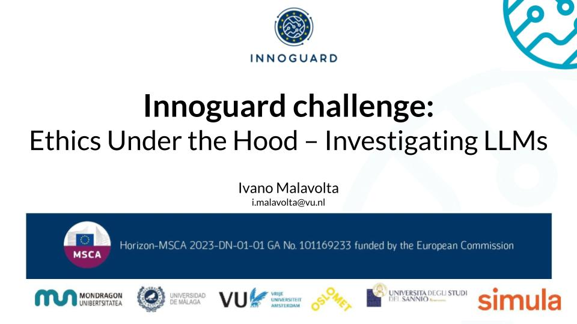

# challenge-llms-ethics

This is the repository containing the material for the "Ethics Under the Hood – Investigating LLMs" challenge.

## Context

This challenge is given in the context of the second [Innoguard](https://www.innoguard.eu/) summer school at the Università degli Studi del Sannio (Italy). 

[Innoguard](https://www.innoguard.eu/) is an MSCA Doctoral Network Project with the main goal of improving the quality assurance of Autonomous Cyber-Physical Systems (ACPSs) via AI. The main goal of the InnoGuard project is to develop novel techniques, as well as methodological principles for the exploitation of AI methods such as deep learning, evolutionary algorithms, reinforcement learning, and large language models engineering, in the context of quality assurance activities of ACPSs. While ACPS development is a complex activity for which automation is highly desirable in various phases, including for example requirement engineering, design, or coding, our focus is on quality assurance, especially considering the high dependability requirements many of such systems have.

Partners in the consortium: 
- Mondragon University (Spain)
- Universita degli Studi del Sannio (Italy)
- Simula Research Laboratory (Norway)
- Oslo Metropilitan University (Norway)
- Vrije Universiteit Amsterdam (Netherlands)
- University of Malaga (Spain)
- Zurcher Hochschule Fur Angewandte Wissenschaften (Switzerland)

## What is this challenge about?

The challenge is a 1.5-days initiative in which PhD candidates will explort the ethical dimensions of Large Language Models (LLMs). The participants to the challenge get an hands-on experience on real-world risks and dilemmas that arise from the usage of LLMs. 

The details of the challenge are provided in this slide deck.
[](href="https://docs.google.com/presentation/d/1f__61_6sa8cGd4no018wLMskooux8XR7UypTFNqkRXQ/edit?usp=sharing)

Technically, the challenge is based on [Nebula](https://networkinstitute.org/nebula/), an open-source platform dedicated to researchers for hosting and running open Large Language Models (LLMs) as well as small language models and other foundational AI models. Nebula is fully localized at the Vrije Universiteit Amsterdam and it is managed by the [Network Institute](https://networkinstitute.org). 

## Main phases of the challenge

- Phase 1: Exploration & Scenario Building
- Phase 2: Familiarization with the technical aspects of the challenge
- Phase 3: Evidence gathering
- Phase 4: Analysis & recommendations development
- Phase 5: Pitch preparation
- Phase 6: Final presentation

## Structure of this repo
```
.
├── nebula_client_example.py # Example of client for interacting with the Rest API of Nebula
├── pdf2text_converter.py    # Basic Python script for converting a PDF file into a plain txt file
├── LICENSE
└── README.md
```

Other examples of Nebula clients are available here: [https://github.com/networkinstitutevu/nebula-api-examples](https://github.com/networkinstitutevu/nebula-api-examples)

Other examples of prompts are available in the [TALLMesh](https://arxiv.org/abs/2504.13892) repo: [https://github.com/sdptn/TALLMesh_multi_page/blob/master/prompts.py](https://github.com/sdptn/TALLMesh_multi_page/blob/master/prompts.py) 

## Usage of the scripts

1. Clone this repo:

   ```
   git clone https://github.com/S2-group/challenge-llms-ethics
   cd challenge-llms-ethics
   ```

2. Create a virtual environment:

   ```
   python -m venv venv
   source venv/bin/activate  # On Windows use venv\Scripts\activate
   ```

3. Install the required packages:

   ```
   pip install pyobjc-framework-Quartz
   ```

4. Convert a PDF document to a textual file:

   ```
   # Convert a single PDF file:
   python pdf2text_converter.py <path of the PDF file> 

   # If you need to convert multiple files in a folder:
   for file in "<folder name>"/* ; do
    python pdf2text_converter.py "$file"
   done
   ```

5. Make a call to the Nebula API:

   ```
   python nebula_client_example.py # Inspect the source code for the details
   ```

## Contact point

[Ivano Malavolta](https://www.ivanomalavolta.com)


